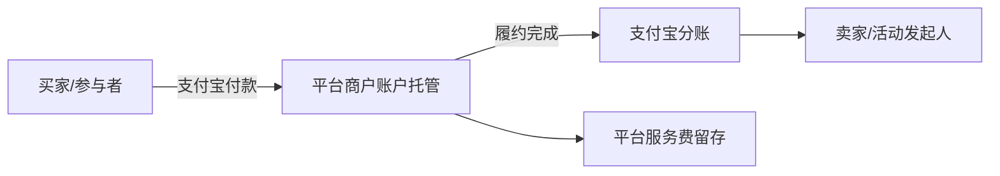
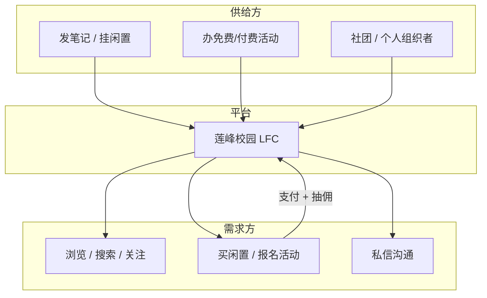
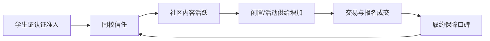
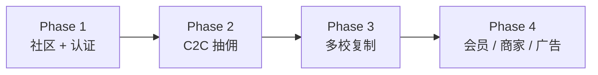
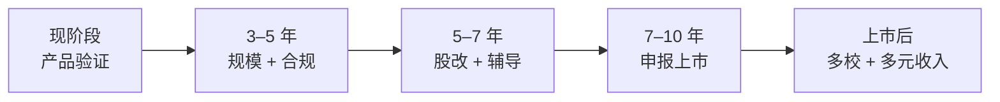
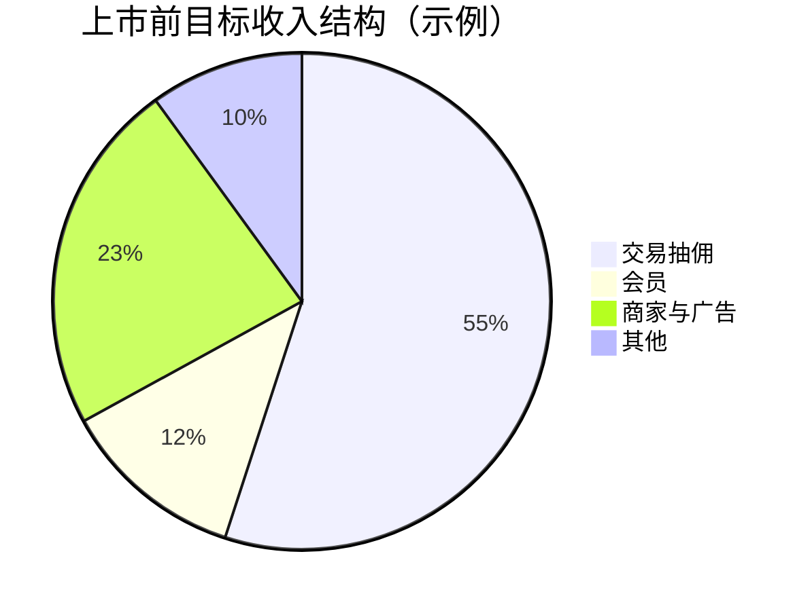
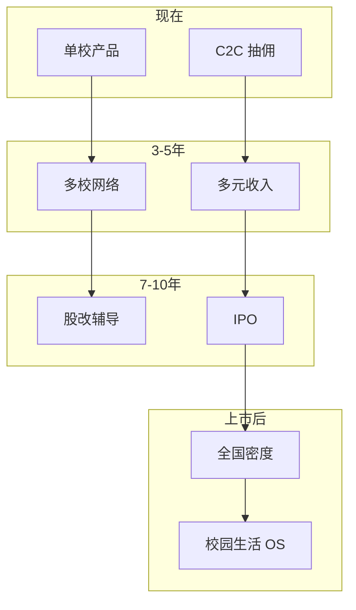

# 莲峰校园（LFC）商业模式

> 基于当前代码实现整理，反映 App 实际已落地的商业逻辑。

## 目录

| 章节 | 内容 |
|------|------|
| 一～八 | 定位、抽佣模式、变现链路、资金机制、免费功能、治理、未实现项、总结 |
| 九 | 单笔交易算账示例 |
| 十 | 对外 BP 精简版 |
| 十一 | 双边市场结构 |
| 十二 | 单元经济学 |
| 十三 | 单校收入测算模型 |
| 十四 | 增长飞轮与冷启动 |
| 十五 | 成本结构 |
| 十六 | 竞争格局与护城河 |
| 十七 | 风险与合规 |
| 十八 | 未来扩展收入方向 |
| 十九 | 多校扩张 playbook |
| 二十 | 关键指标仪表盘 |
| 二十一 | 学期节奏运营日历 |
| 二十二 | 商业模式演进路径 |
| **二十三～三十五** | **上市战略（愿景、路径、里程碑、财务门槛、合规、招股书、Post-IPO）** |
| 附录 | 相关代码路径 |

---

## 一、产品定位

**校园垂直社区 + C2C 交易 + 活动组织平台**

面向已认证学生用户，提供：

- **内容社区**：笔记瀑布流、点赞/收藏/评论、关注、搜索
- **校园活动**：发布/报名、地点导航、审核上线
- **闲置交易**：笔记可挂商品（二手等），支付宝下单
- **即时沟通**：私信聊天
- **个人主页**：发布内容、活动、收藏等

注册需 **学号 + 学生证**，保证用户池是校园人群。

---

## 二、核心商业模式：C2C 平台抽佣

平台本身**不卖货、不办活动**，只做撮合与资金托管，从每笔交易中收取 **平台服务费**。

| 配置项 | 默认值 | 说明 |
|--------|--------|------|
| `PAYMENT_PLATFORM_FEE_RATE` | **5%** | 平台服务费率 |
| `PAYMENT_PLATFORM_FEE_MIN` | 0 元 | 单笔最低服务费 |
| `PAYMENT_AUTO_CONFIRM_DAYS` | 7 天 | 闲置商品自动确认收货 |

**分钱逻辑**：买家付全款 → 先进平台支付宝商户账户 → 履约完成后通过 **支付宝分账** 打给卖家/发起人，**平台费留在商户账户**。

---

## 三、两条变现链路

### 1. 闲置商品交易（笔记带货）

- 用户在发笔记时可开启「商品」，设置价格
- 买家支付宝付款 → **平台托管**
- 买家确认收货（或 7 天自动确认）→ 分账给卖家（扣平台费）
- 支持售后/退款

**平台收入**：每笔成交的 **5% 服务费**

### 2. 付费活动报名

- 发起人发布活动时可设报名费（也可免费）
- 参与者支付宝报名 → **锁定名额 + 资金托管**
- **活动结束后** 分账给发起人（扣平台费）
- 活动开始前可申请退款

**平台收入**：每笔报名费的 **5% 服务费**

---

## 四、资金与信任机制



### 收款与分账

- **收款方**：卖家/活动发起人须 OAuth 绑定个人支付宝（普通用户即可，非商户）
- **分账方式**：支付宝商家分账（royalty），平台费留在商户账户，其余打给 C2C 收款方

### 履约保障

| 业务类型 | 履约流程 |
|----------|----------|
| 闲置商品 | 支付下单 → 平台托管 → 确认收货 → 分账完成 |
| 活动报名 | 支付报名 → 锁定名额 → 活动履约 → 分账完成 |

- 订单页展示「履约保障」进度条与说明
- 闲置：确认收货后分账；超时未确认自动完成（默认 7 天）
- 活动：活动结束后分账；活动开始前可申请退款
- 支持售后/退款通道

### 支付渠道

- **当前主用**：支付宝
- **已预留**：微信支付（schema 与配置已存在，尚未作为主路径）

---

## 五、免费功能（拉新与留存，不直接收费）

| 功能 | 是否收费 |
|------|----------|
| 发笔记、浏览、社交互动 | 免费 |
| 免费活动发布/报名 | 免费 |
| 私信、关注、个人主页 | 免费 |
| 高德导航到活动地点 | 免费 |

社交和内容免费，**交易环节才产生平台收入**——典型「社区引流 + 交易变现」模式。

---

## 六、平台治理

- **用户准入**：学号 + 学生证注册，锁定校园用户池
- **活动审核**：新活动需后台审核通过后才会在 feed 展示、可被点赞收藏
- **交易风控**：资金托管 + 履约保障 + 售后退款，降低 C2C 交易纠纷

---

## 七、当前尚未实现的商业模式

从代码看，目前**尚未实现**：

- 会员 / 订阅（VIP）
- 广告收入
- 平台自营电商
- B 端（商家入驻费、SaaS 服务费）
- 信息流推广 / 竞价

---

## 八、一句话总结

> **莲峰校园 = 校园版「小红书 + 闲鱼 + 活动报名」**
>
> 通过 **学生证认证** 锁定校园用户，用 **免费社区** 做流量，在 **闲置交易** 和 **付费活动报名** 两条 C2C 链路上，以 **约 5% 平台服务费 + 资金托管分账** 作为主要收入来源。

---

## 九、单笔交易算账示例

> 以下按默认配置计算：**费率 5%**，**最低服务费 0 元**。  
> 公式：`平台服务费 = 订单金额 × 5%`（四舍五入到分），`收款方到账 = 订单金额 − 平台服务费`。

### 闲置商品（单笔）

| 商品标价 | 买家实付 | 平台服务费（5%） | 卖家到账 |
|----------|----------|------------------|----------|
| ¥9.90 | ¥9.90 | ¥0.50 | ¥9.40 |
| ¥50.00 | ¥50.00 | ¥2.50 | ¥47.50 |
| ¥100.00 | ¥100.00 | ¥5.00 | ¥95.00 |
| ¥199.00 | ¥199.00 | ¥9.95 | ¥189.05 |
| ¥500.00 | ¥500.00 | ¥25.00 | ¥475.00 |

**示例**：同学 A 在笔记里挂出一本二手教材，标价 **¥50**。

1. 同学 B 支付宝付款 **¥50**，款项进入平台托管
2. B 确认收货（或 7 天自动确认）
3. 平台留 **¥2.50**，分账 **¥47.50** 到 A 的支付宝

---

### 付费活动（单笔报名）

| 报名费 | 参与者实付 | 平台服务费（5%） | 发起人到账 |
|--------|------------|------------------|------------|
| ¥0（免费） | ¥0 | ¥0 | — |
| ¥20.00 | ¥20.00 | ¥1.00 | ¥19.00 |
| ¥50.00 | ¥50.00 | ¥2.50 | ¥47.50 |
| ¥99.00 | ¥99.00 | ¥4.95 | ¥94.05 |

**示例**：社团发起一场付费活动，报名费 **¥50/人**。

1. 参与者 C 支付 **¥50**，锁定名额，资金托管
2. 活动结束后平台分账
3. 平台留 **¥2.50**，**¥47.50** 打到发起人支付宝

---

### 付费活动（多人合计）

| 场景 | 报名人数 | 单价 | 总 GMV | 平台总收入 | 发起人总到账 |
|------|----------|------|--------|------------|--------------|
| 小型讲座 | 10 人 | ¥20 | ¥200 | ¥10.00 | ¥190.00 |
| 社团活动 | 30 人 | ¥50 | ¥1,500 | ¥75.00 | ¥1,425.00 |
| 大型活动 | 100 人 | ¥30 | ¥3,000 | ¥150.00 | ¥2,850.00 |

> **GMV** = 用户支付总额；**平台收入** = GMV × 5%；**发起人总到账** = GMV − 平台收入。

---

### 若开启「最低服务费」

当环境变量 `PAYMENT_PLATFORM_FEE_MIN=1`（单笔最低 ¥1）时，小额订单的平台费不会低于 1 元：

| 订单金额 | 按 5% 计算 | 实际平台费 | 收款方到账 |
|----------|------------|------------|------------|
| ¥10.00 | ¥0.50 | **¥1.00** | ¥9.00 |
| ¥50.00 | ¥2.50 | ¥2.50 | ¥47.50 |
| ¥100.00 | ¥5.00 | ¥5.00 | ¥95.00 |

当前默认 `PAYMENT_PLATFORM_FEE_MIN=0`，小额订单仍按 5% 比例收取。

---

### 与闲鱼等平台对比（概念层）

| 维度 | 莲峰校园 | 典型综合二手平台 |
|------|----------|------------------|
| 用户池 | 学生证认证，校园封闭 | 全网开放 |
| 交易场景 | 笔记带货 + 活动报名 | 以闲置为主 |
| 平台收入 | 交易服务费（约 5%） | 交易服务费 + 广告等 |
| 资金模式 | 托管后分账 | 托管 / 担保交易 |
| 社交 | 社区内容驱动交易 | 交易驱动为主 |

校园场景客单价通常低于全网二手，但 **信任成本更低、履约距离更短**，适合高频小额 C2C。

---

## 十、对外 BP 版本（精简）

> 可直接用于路演 PPT、合作洽谈、投资初聊。数据类字段请按实际运营情况替换。

### 1. 我们在做什么

**莲峰校园（LFC）** 是面向大学生的 **校园生活服务平台**，把 **内容社区、闲置交易、活动组织** 整合在一个 App 里，让学生在同学校园内完成「看内容 → 找好物 → 参加活动 → 私信沟通」的闭环。

### 2. 解决什么问题

| 痛点 | 我们的方案 |
|------|------------|
| 校园闲置流转分散（群聊、表白墙） | 笔记挂商品 + 支付宝担保交易 |
| 活动报名靠表格/群收款，难追溯 | 活动页一键报名 + 名额锁定 + 托管分账 |
| 校园信息碎片化 | 瀑布流社区 + 搜索 + 个人主页 |
| 陌生人交易缺乏信任 | 学生证准入 + 资金托管 + 售后退款 |

### 3. 目标用户

- **核心用户**：已注册认证的高校学生
- **供给方**：卖闲置的同学、办活动的社团/个人
- **需求方**：买家、活动参与者

### 4. 商业模式

- **模式**：C2C 平台抽佣 + 资金托管分账
- **收入来源**：闲置成交、付费活动报名产生的 **平台服务费（默认 5%）**
- **免费层**：社区浏览、发帖、免费活动、社交功能——用于拉新和留存

### 5. 产品矩阵

```
社区内容（免费）  →  引流与活跃
    ↓
闲置交易（抽佣）  →  高频小额变现
    ↓
付费活动（抽佣）  →  场景化变现
```

### 6. 竞争与差异

- **vs 综合二手平台**：更垂直、更可信（同校 + 学生证）
- **vs 纯社区 App**：有交易闭环，不只是内容
- **vs 群收款/表格**：有订单、托管、退款、分账，合规可追溯

### 7. 关键指标（示例框架）

| 指标 | 说明 |
|------|------|
| DAU / MAU | 日活 / 月活 |
| 注册认证率 | 完成学生证认证占比 |
| GMV | 月交易总额（闲置 + 活动） |
| 抽佣收入 | GMV × 平台费率 |
| 活动发布数 / 报名转化率 | 活动侧健康度 |
| 笔记挂商品率 / 成交转化率 | 闲置侧健康度 |

### 8. 发展阶段（建议叙事）

| 阶段 | 目标 |
|------|------|
| **Phase 1** | 单校冷启动：社区内容 + 免费活动，积累用户 |
| **Phase 2** | 打通支付分账：闲置 + 付费活动跑通闭环 |
| **Phase 3** | 复制到更多校区，提升 GMV 与复购 |
| **Phase 4（可选）** | 会员、校园商家、广告等增量收入 |

### 9. 融资 / 合作一句话

> 莲峰校园以 **学生证认证的校园 C2C 平台** 切入高校市场，通过 **社区免费 + 交易抽佣** 实现可持续变现，资金走 **支付宝托管分账**，合规且可规模化复制到更多学校。

---

## 十一、双边市场结构

莲峰校园本质是 **校园版双边平台**：一边连接内容/交易供给方，一边连接消费与参与方。



| 角色 | 典型行为 | 平台价值 |
|------|----------|----------|
| **内容创作者** | 发笔记、获赞藏、涨粉 | 提供信息流，带动活跃 |
| **闲置卖家** | 笔记挂商品、绑定支付宝收款 | 产生 GMV 与抽佣 |
| **活动发起人** | 发布活动、设报名费、审核上线 | 产生场景化 GMV |
| **买家 / 参与者** | 下单、报名、确认收货 | 完成交易闭环 |
| **围观用户** | 浏览、收藏、分享 | 扩大传播与信任 |

**网络效应路径**：同校用户越多 → 匹配效率越高 → 交易/报名越容易成交 → 更多用户愿意发布供给 → 社区更活跃。

---

## 十二、单元经济学（Unit Economics）

> 用于判断「每多一笔交易，平台是否划算」。

### 单笔交易贡献（Take Rate 模型）

| 变量 | 含义 | 当前默认 |
|------|------|----------|
| AOV | 平均客单价 | 校园场景约 ¥30–¥80（待运营验证） |
| Take Rate | 平台抽佣比例 | 5% |
| 单笔平台收入 | AOV × Take Rate | 约 ¥1.5–¥4 |
| 支付通道成本 | 支付宝等手续费 | 由商户协议决定，需单独核算 |
| 单笔净贡献 | 平台收入 − 通道/运营成本分摊 | 取决于规模 |

**示例**：客单价 **¥50**，平台抽 **¥2.50**。若支付通道综合成本按 0.6% 估算（约 ¥0.30），则单笔毛贡献约 **¥2.20**（未扣人工、服务器、审核等固定成本）。

### 用户生命周期价值（LTV，框架）

```
LTV ≈ 人均成交笔数 × 单笔平台收入 × 留存周期系数
```

| 用户类型 | 典型贡献 | 说明 |
|----------|----------|------|
| 纯浏览用户 | ¥0 直接收入 | 贡献活跃与内容，间接带动交易 |
| 偶尔买家 | 低 | 毕业季、开学季可能集中交易 |
| 活跃卖家 / 活动主 | 高 | 持续产生 GMV |
| 社团账号 | 中高 | 周期性付费活动 |

校园 App 的 LTV 往往 **低于全网电商**，但 **获客成本（CAC）也可更低**（同校口碑、社团地推、表白墙引流）。

---

## 十三、单校收入测算模型（示例）

> 以下为 **假设推演**，便于 BP 或内部目标拆解；请替换为真实运营数据。

### 假设条件（单校、单学期）

| 假设项 | 保守 | 中性 | 乐观 |
|--------|------|------|------|
| 认证用户数 | 2,000 | 5,000 | 10,000 |
| 月活率（MAU/注册用户） | 25% | 35% | 45% |
| 月交易用户数（买卖/报名） | 3% | 6% | 10% |
| 人均月成交笔数 | 0.5 | 0.8 | 1.2 |
| 平均客单价 AOV | ¥35 | ¥50 | ¥65 |

### 月 GMV 与平台收入（5% 抽佣）

| 场景 | 月交易用户 | 月订单量 | 月 GMV | 月平台收入（5%） |
|------|------------|----------|--------|------------------|
| 保守 | 60 | 30 | ¥1,050 | **¥52.5** |
| 中性 | 300 | 240 | ¥12,000 | **¥600** |
| 乐观 | 1,000 | 1,200 | ¥78,000 | **¥3,900** |

### 活动侧单独估算

假设每学期 **20 场**付费活动，平均每场 **25 人**报名，单价 **¥30**：

- 单场 GMV = ¥750，平台收入 = **¥37.5**
- 每学期活动平台收入 ≈ **¥750**（20 场）

**结论（示例层）**：

- 单校早期收入规模通常 **不大**，商业模式成立的关键是：**低 CAC + 高复购 + 多校复制**。
- 开学季、毕业季、社团招新季是 **GMV 脉冲窗口**，运营应提前备货类笔记与活动模板。

---

## 十四、增长飞轮与冷启动

### 飞轮模型



### 冷启动建议（单校）

| 阶段 | 目标 | 动作 |
|------|------|------|
| **0→1** | 500 认证用户 | 社团合作、宿舍地推、扫码加主页 |
| **1→N 内容** | 日更笔记 | 官方示例号、二手教材/器材话题 |
| **交易破冰** | 首笔成交 | 低价教材、免费+付费活动组合 |
| **信任固化** | 低纠纷率 | 强调托管分账、订单可追溯 |
| **裂变** | 主页码传播 | 扫码关注、分享主页（已支持） |

### 关键转化漏斗

```
注册 → 学生证认证 → 首次发帖/浏览 → 首次私信
  → 首次下单/报名 → 确认履约 → 二次交易
```

建议重点监控：**认证转化率**、**挂商品笔记占比**、**活动报名转化率**、**支付完成率**、**售后率**。

---

## 十五、成本结构

| 成本类型 | 主要内容 | 特征 |
|----------|----------|------|
| **固定成本** | 服务器、对象存储、域名、开发维护 | 随用户量缓慢增长 |
| **变动成本** | 支付通道费、短信（如有）、CDN 流量 | 随 GMV 增长 |
| **运营成本** | 活动审核、客诉/售后处理、校园地推 | 随学校扩张线性增加 |
| **合规成本** | 支付与分账资质、隐私与数据合规 | 一次性 + 年度维护 |

**规模效应**：当 GMV 增大时，固定成本被摊薄；但当拓展到新学校时，运营成本可能 **近似按校复制**。

---

## 十六、竞争格局与护城河

### 主要替代方案

| 替代方案 | 优势 | 劣势 |
|----------|------|------|
| 微信群 / 表白墙 | 零门槛、即时 | 无订单、无托管、难追溯 |
| 闲鱼等综合二手 | 流量大 | 非同校、信任成本高 |
| 问卷星 / 群收款 | 活动收集快 | 无社区、无分账合规闭环 |
| 校园小程序 | 轻量 | 难形成内容社区与社交留存 |

### 莲峰校园的差异化（护城河构建方向）

1. **身份壁垒**：学号 + 学生证，限定真实校园用户
2. **场景闭环**：内容 → 交易 → 私信 → 活动，在同一 App 完成
3. **资金信任**：支付宝托管 + 分账 + 履约保障 + 售后
4. **社交资产**：关注、主页、LFC 号、扫码加好友（提高迁移成本）
5. **本地网络效应**：同校密度越高，平台越难被替代

> 护城河深度取决于 **单校活跃用户密度**，而非功能清单本身。

---

## 十七、风险与合规

| 风险类型 | 描述 | 应对思路 |
|----------|------|----------|
| **交易纠纷** | 闲置成色不符、活动未举办 | 托管分账、售后退款、活动审核 |
| **支付合规** | 二清、分账资质 | 走支付宝商家分账；收款方实名绑定 |
| **虚假身份** | 非学生注册 | 学生证审核；异常账号处置 |
| **违规内容** | 笔记/活动违规 | 活动后台审核；后续可扩展内容审核 |
| **低价高频刷单** | 套取信任或洗钱 | 风控规则、异常订单监测（待建设） |
| **单校依赖** | 一所学校活跃度不足 | 多校复制；学期节奏运营 |

**合规底线**：平台定位为 **信息撮合 + 资金托管分账**，不自行沉淀用户资金用于其他用途；分账在履约完成后执行。

---

## 十八、未来扩展收入方向

> 以下均为 **规划中/未实现**，按优先级与可行性排列。

### 短期可落地（与现有架构协同）

| 方向 | 模式 | 与现状关系 |
|------|------|------------|
| **最低服务费** | `PAYMENT_PLATFORM_FEE_MIN` 已支持配置 | 提升小额订单单位收益 |
| **微信支付** | schema 已预留 | 扩大支付覆盖 |
| **活动推广位** | 首页/活动 Tab 置顶 | 社团付费曝光 |
| **交易评价体系** | 订单评价 API 已有 | 提升信任 → 提高转化率 |

### 中期探索

| 方向 | 模式 | 说明 |
|------|------|------|
| **校园会员** | 月费/学期费 | 免广告、活动优先报名、主页装饰 |
| **校园商家入驻** | 食堂/打印店/奶茶店 | 固定佣金或广告位 |
| **付费置顶笔记** | CPC/CPM 或按天 | 类似同城曝光 |
| **代发/信用服务** | 手续费 | 需完整风控与资质 |

### 长期愿景

| 方向 | 模式 |
|------|------|
| **跨校活动联盟** | 大型活动票务抽佣 |
| **毕业季集市** | 季节性 GMV 峰值运营 |
| **校友网络** | 毕业后延伸（需重新定义准入） |
| **数据服务（脱敏）** | 校园消费趋势报告（B 端） |

---

## 十九、多校扩张 playbook（建议）

| 步骤 | 动作 | 成功标准 |
|------|------|----------|
| 1 | 选 1 所种子学校跑通 PMF | 月 GMV 稳定、纠纷率可控 |
| 2 | 沉淀 SOP：审核、地推、社团合作话术 | 可复制文档 |
| 3 | 模板化：开学季/毕业季运营包 | 活动 + 闲置品类清单 |
| 4 | 进入相邻学校 | 注册认证数、MAU |
| 5 | 各校独立社区，统一支付与分账 | 后台多校管理（待建设） |

**扩张约束**：每校需重新建立 **本地供给与信任**，不能简单复制用户；技术栈可复用，运营需本地化。

---

## 二十、关键指标仪表盘（建议）

### 北极星指标（North Star）

> 推荐：**月成功履约订单数**（含闲置成交 + 活动报名完成）

兼顾 GMV 与真实价值交付，比单纯 DAU 更贴近商业模式。

### 一级指标

| 指标 | 公式/说明 | 用途 |
|------|-----------|------|
| GMV | 月支付成功总额 | 规模 |
| 平台抽佣收入 | GMV × 5% | 营收 |
| 认证用户 MAU | 月活认证用户 | 健康度 |
| 交易渗透率 | 月交易用户 / MAU | 变现效率 |
| 挂商品笔记率 | 带商品笔记 / 总笔记 | 供给 |
| 活动付费率 | 付费活动 / 总活动 | 供给质量 |

### 二级指标

| 指标 | 说明 |
|------|------|
| 支付成功率 | 下单 → 支付完成 |
| 分账成功率 | 履约后分账是否成功 |
| 售后率 | 售后订单 / 总订单 |
| 活动审核通过率 | 运营效率 |
| 人均关注数 / 私信数 | 社交粘性 |

---

## 二十一、学期节奏运营日历（示例）

| 时间节点 | 用户行为 | 运营机会 |
|----------|----------|----------|
| **9 月开学** | 买教材、找室友、社团招新 | 二手教材、社团免费活动、迎新话题 |
| **10–11 月** | 稳定上课、社团活动 | 付费讲座、比赛报名 |
| **12 月** | 期末、闲置出清 | 复习资料、电子产品流转 |
| **3 月开学** | 二手复苏 | 教材第二轮流转 |
| **5–6 月** | 毕业季 | 大件闲置、转租、毕业市集 |
| **暑假** | 活跃度下降 | 实习话题、低价清仓 |

---

## 二十二、总结：商业模式演进路径



| 阶段 | 核心命题 | 收入特征 |
|------|----------|----------|
| **现在** | 单校产品闭环是否跑通 | 交易抽佣为主，规模小 |
| **下一步** | 同校密度 + 交易渗透率 | GMV 随学期波动 |
| **中期** | 多校复制 + 运营 SOP | 收入随学校数线性叠加 |
| **长期** | 校园生活 OS + 多元变现 | 抽佣 + 会员 + B 端 |

**莲峰校园的商业本质**：不是先做大盘流量，而是做 **高信任密度的校园网络**；信任到位后，闲置与活动自然产生交易，平台从 **5% 服务费** 中持续获益。

---

# 第三部分：上市战略（长期目标）

> 以下内容为 **战略规划框架**，非财务预测或法律意见。具体上市板块、时间表、财务数据须以届时监管规则、审计结果及中介机构意见为准。

---

## 二十三、上市愿景与战略定位

### 愿景

> **成为中国领先的校园生活服务平台，以「真实身份 + 社区信任 + 合规交易」连接千万大学生，并完成公开市场融资。**

### 上市的战略意义

| 维度 | 意义 |
|------|------|
| **品牌** | 提升高校、社团、合作商户与用户的信任 |
| **资本** | 为多校扩张、技术研发、合规建设提供长期资金 |
| **治理** | 倒逼财务规范、内控完善、信息披露透明 |
| **人才** | 股权激励与上市公司平台吸引核心团队 |
| **并购** | 上市后具备并购同业、互补产品的能力 |

### 资本市场叙事（Elevator Pitch）

> 莲峰校园是 **垂直于高校的社区电商与本地生活平台**：以学生证认证构建高信任用户池，以社区内容获取流量，以 C2C 闲置与活动报名实现变现，并沿 **会员、校园商家、广告** 延伸第二增长曲线。我们对标的是 **「校园版小红书 × 闲鱼 × 活动平台」** 的品类空白，而非与全网巨头正面竞争流量。

---

## 二十四、上市路径选择（参考）

### 可选板块对比

| 路径 | 适合阶段 | 优势 | 挑战 |
|------|----------|------|------|
| **港股主板** | 收入规模较大、盈利稳定 | 国际化、融资灵活 | 估值受市场情绪影响 |
| **港股 18A（未盈利生物/科技）** | 高成长、尚未盈利的科技平台 | 允许未盈利上市 | 莲峰需证明「科技属性」与成长速度 |
| **A 股科创板** | 硬科技 + 高研发投入叙事 | 国内品牌、政策支持 | 审核严格；社区平台需强化「技术平台」定位 |
| **A 股创业板** | 成长型、已具备一定规模 | 受众熟悉 | 盈利或增长门槛需达标 |
| **美股（NASDAQ）** | 全球化叙事、高成长 | 估值体系偏成长 | 合规成本、地缘与审计要求 |

### 建议策略（分步）



1. **现阶段**：不急于绑定单一板块，先跑通商业模式与合规底座。
2. **成长期**：按 **港股 / A 股** 两套口径同步规范财务（便于最终择一）。
3. **Pre-IPO**：引入具备上市经验的投资方、券商辅导，明确目标板块。

---

## 二十五、分阶段里程碑（5 / 8 / 10 年路线图）

### Phase A：产品验证期（第 1–2 年，当前）

| 目标 | 关键结果（KR） |
|------|----------------|
| 单校 PMF | 种子校认证用户 5,000+，月 GMV 稳定 |
| 交易闭环 | 支付、托管、分账、售后全链路可用 |
| 合规底座 | 支付宝分账合规；用户隐私与数据安全基线 |
| 组织 | 核心团队 5–15 人，股权结构清晰 |

### Phase B：区域复制期（第 3–4 年）

| 目标 | 关键结果（KR） |
|------|----------------|
| 多校网络 | 覆盖 **20–50 所** 高校 |
| 规模 | 认证用户 **50 万–100 万**，年 GMV **5,000 万–1 亿** |
| 收入 | 平台抽佣 + 增值收入，年收入 **500 万–1,500 万** |
| 系统 | 多校运营后台、风控、数据报表 |
| 融资 | 完成 A 轮 / B 轮，引入产业或财务投资者 |

### Phase C：全国扩张期（第 5–6 年）

| 目标 | 关键结果（KR） |
|------|----------------|
| 全国布局 | 覆盖 **200+ 所** 本科院校（战略性铺点） |
| 规模 | 认证用户 **500 万+**，年 GMV **10 亿+** |
| 收入结构 | 抽佣占比下降，会员 / 商家 / 广告占比提升至 **30%+** |
| 盈利 | 经营性盈亏平衡或小幅盈利 |
| 治理 | 股改完成，三会一层、内控、审计体系就绪 |

### Phase D：Pre-IPO 期（第 7–8 年）

| 目标 | 关键结果（KR） |
|------|----------------|
| 财务规范 | 连续 3 年审计报告无重大保留 |
| 合规 | 数据安全、个人信息保护、支付合规专项审查 |
| 资本 | 引入 Pre-IPO 轮；股权结构符合上市要求 |
| 辅导 | 券商 + 律师 + 会计师 IPO 辅导备案 |

### Phase E：申报与上市（第 8–10 年，目标窗口）

| 目标 | 关键结果（KR） |
|------|----------------|
| 申报 | 提交招股书，完成问询回复 |
| 上市 | 成功挂牌，募集资金用于扩张与研发 |
| 披露 | 建立定期报告与投资者关系机制 |

> **时间仅为战略参考**：若增长显著快于预期，Pre-IPO 可提前；若监管环境变化，需灵活调整板块与节奏。

---

## 二十六、上市前财务与规模门槛（参考区间）

> 不同板块规则动态变化，下表为 **内部目标区间**，用于倒推年度 KPI，不构成上市承诺。

### 业务规模目标（申报前 1–2 年）

| 指标 | 参考目标区间 | 说明 |
|------|--------------|------|
| 年 GMV | **10 亿 – 30 亿+** | 体现平台交易规模 |
| 年收入（平台侧） | **1 亿 – 3 亿+** | 抽佣 + 会员 + 广告 + B 端 |
| 认证用户数 | **500 万 – 1,000 万+** | 累计或活跃口径需统一 |
| MAU | **100 万 – 300 万+** | 体现持续活跃 |
| 覆盖高校数 | **200 – 400 所** | 战略性覆盖，非简单数量 |
| 月交易渗透率 | **8% – 15%** | MAU 中有交易行为的比例 |

### 财务质量目标

| 指标 | 参考方向 |
|------|----------|
| 收入复合增长率 | 近 3 年 **30% – 50%+**（成长期平台） |
| 毛利率 | 平台抽佣业务毛利率高，综合需 **60%+** |
| 经调整净利率 | 上市前 1–2 年趋向盈亏平衡或微利 |
| 经营现金流 | 避免长期严重失血，IPO 前趋稳 |
| 收入确认 | 抽佣收入在 **履约 / 分账完成** 时确认（与现有逻辑一致） |

### 从当前 5% 抽佣倒推（示例）

若上市前目标 **平台年收入 1 亿元**，仅抽佣单一来源则需：

```
年 GMV ≈ 1 亿 ÷ 5% = 20 亿元
```

因此 **必须在中期引入会员、广告、B 端等第二曲线**，降低对单一抽佣的依赖，同时提升估值叙事。

---

## 二十七、收入结构演进（上市叙事必备）

上市审核与投资者均关注 **收入多元性与可持续性**。

### 目标收入占比（申报前理想结构，示例）

| 来源 | 现在 | 中期 | 上市前目标 |
|------|------|------|------------|
| 交易服务费（抽佣） | ~100% | 70% | **50% – 60%** |
| 会员订阅 | 0 | 10% | **10% – 15%** |
| 校园商家 / 广告 | 0 | 15% | **20% – 25%** |
| 数据 / SaaS / 其他 | 0 | 5% | **5% – 10%** |



**叙事要点**：从「二手抽佣工具」升级为 **「校园生活 OS + 商业化平台」**。

---

## 二十八、公司治理与股权结构

### 上市前必须完成的公司治理建设

| 模块 | 要求 |
|------|------|
| **主体架构** | 有限责任公司 → 股份有限公司（股改） |
| **三会一层** | 股东大会、董事会、监事会、管理层 |
| **独立董事** | 按板块要求配置 |
| **关联交易** | 与创始人、关联方的交易公允披露 |
| **股权激励** | ESOP / 期权池，通常预留 **10% – 15%** |
| **VIE 结构** | 若涉及外资，需提前规划（视实际情况） |

### 融资轮次规划（参考）

| 轮次 | 阶段 | 典型用途 | 估值逻辑 |
|------|------|----------|----------|
| 天使 / 种子 | 产品验证 | 研发、单校冷启动 | 团队 + 产品 |
| Pre-A / A 轮 | 单校 PMF | 多校复制、运营 | 用户 + GMV |
| B 轮 | 区域扩张 | 50 校、风控、中台 | 收入 + 增长率 |
| C 轮 | 全国布局 | 200 校、多元收入 | 规模 + 单位经济 |
| Pre-IPO | 股改前 | 合规、并购、储备 | 盈利路径清晰 |
| IPO | 公开市场 | 品牌、持续扩张 | 二级市场定价 |

### 股权稀释原则（内部参考）

- 创始人团队：**50% – 60%**（IPO 后仍保持控制权为宜）
- 员工期权池：**10% – 15%**
- 机构投资者：累计 **25% – 35%**
- 考虑 **AB 股 / 一致行动人** 等保障控制权方案（视板块规则）

---

## 二十九、上市合规清单

### 业务合规

| 项 | 现状 | 上市前需达到 |
|----|------|--------------|
| 支付与分账 | 支付宝分账已接入 | 持续合规审计；备微信支付 |
| 资金托管 | 履约后分账 | 完整风控与备付金说明 |
| 用户身份 | 学号 + 学生证 | KYC 流程文档化、可追溯 |
| 内容与活动 | 活动审核 | 全平台内容审核体系 + 举报机制 |
| 个人信息 | 基础合规 | 符合《个人信息保护法》，PIPIA 评估 |
| 数据安全 | 待完善 | 等保、渗透测试、日志留存 |
| 知识产权 | 自有代码 | 软著、商标、专利布局 |

### 财务合规

- 聘请 **四大或国内头部** 审计机构连续审计
- 收入、成本、费用 **按 CAS / IFRS** 一致确认
- 禁止通过刷单虚增 GMV（上市红线）
- 关联交易、对外担保、重大合同台账完整

### 技术合规

- 核心业务系统 **高可用**（SLA 99.9%+）
- 数据备份、灾备、安全事件响应预案
- 源码归属清晰，无重大开源协议风险
- 日志与订单数据 **可审计、不可篡改**

---

## 三十、招股书核心叙事框架

> 供未来撰写招股书「业务概览」章节时参考。

### 1. 我们是谁

中国领先（或快速成长中的）**校园生活服务平台**，服务经学生证认证的大学生，提供社区、闲置交易、活动组织与即时沟通。

### 2. 市场机会

- 中国高校在校生 **4,000 万+**
- 校园闲置、活动、社交需求高频，但长期分散在微信群
- 垂直平台可建立 **信任 + 密度** 优势

### 3. 商业模式

- 交易抽佣（已验证）+ 会员 + 校园商家 + 广告（成长中）
- 轻资产、高毛利、网络效应

### 4. 竞争壁垒

- 身份认证、同校网络效应、资金托管、社交关系链

### 5. 增长策略

- 多校复制 + 学期运营 + 产品矩阵延伸

### 6. 财务亮点

- GMV 增长、抽佣收入、用户活跃、单位经济改善

### 7. 募集资金用途（典型）

| 用途 | 占比（示例） |
|------|--------------|
| 技术研发与产品 | 35% |
| 市场拓展与校园运营 | 30% |
| 合规、风控与基础设施 | 15% |
| 并购与战略投资 | 10% |
| 营运资金 | 10% |

---

## 三十一、可比公司与估值参考

> 完全对标上市公司较少，以下为 **叙事参考**，非估值建议。

| 类型 | 代表 | 可借鉴点 |
|------|------|----------|
| 社区 + 电商 | 小红书 | 内容引流、年轻用户、生活方式平台 |
| C2C 闲置 | 闲鱼（阿里系） | 二手交易、信任机制 |
| 本地生活 | 美团（早期校园） | 从垂直场景切入 |
| 在线活动 / 票务 | Eventbrite 等 | 活动报名与票务抽佣 |

### 估值逻辑（二级市场常见）

| 阶段 | 常见估值方法 |
|------|--------------|
| 成长期 | PS（市销率）、GMV 倍数 |
| 成熟期 | PE（市盈率）、DCF |
| 平台型 | 每用户价值、每校价值 |

**莲峰校园上市叙事**应强调：**高信任垂直社区 + 合规交易基础设施**，而非纯 GMV 故事。

---

## 三十二、上市后规划（Post-IPO）

### 短期（上市后 1–2 年）

- 巩固 **200+ 校** 密度，提升单校 GMV
- 会员与商家收入占比提升至 **30%+**
- 完善 IR（投资者关系），定期业绩说明会

### 中期（上市后 3–5 年）

- 覆盖 **1,000+ 校**（含高职、应用型本科战略性选择）
- 探索 **校友经济**（合规前提下延伸用户生命周期）
- 并购区域校园 App 或垂直工具

### 长期（上市后 5 年+）

- 成为 **大学生入口级平台**
- 输出校园 SaaS（社团管理、活动票务）给 B 端
- 国际化（华人留学生市场）视情况评估

---

## 三十三、上市相关风险披露（预案）

招股书需如实披露的主要风险方向：

| 风险类别 | 示例 |
|----------|------|
| **监管** | 互联网平台、支付、个人信息监管政策变化 |
| **季节性** | 寒暑假活跃度下降，GMV 波动 |
| **竞争** | 巨头降维、微信群替代 |
| **运营** | 多校扩张导致单位成本上升 |
| **技术** | 系统故障、数据泄露 |
| **财务** | 收入确认政策变化 |
| **控制权** | 创始人减持、股权分散 |

**原则**：业务上提前防范，披露上诚实完整——这是上市公司的长期信用基础。

---

## 三十四、上市倒推：年度 KPI 沙盘（示例）

> 假设目标 **第 8–10 年申报**，倒推关键节点（均为内部规划数，需每年复盘修正）。

| 年份 | 覆盖高校 | 认证用户（累计） | 年 GMV | 平台年收入 | 组织里程碑 |
|------|----------|------------------|--------|------------|------------|
| Y1 | 1–3 | 1 万 | 50 万 | 2.5 万 | 产品闭环 |
| Y2 | 5–10 | 10 万 | 500 万 | 25 万 | 天使/A 轮 |
| Y3 | 20–30 | 30 万 | 3,000 万 | 200 万 | 多校中台 |
| Y4 | 50 | 80 万 | 1 亿 | 800 万 | B 轮 |
| Y5 | 100 | 200 万 | 3 亿 | 2,500 万 | 会员/商家上线 |
| Y6 | 150 | 350 万 | 6 亿 | 5,000 万 | 盈亏平衡探索 |
| Y7 | 200 | 500 万 | 10 亿 | 1 亿 | 股改、辅导 |
| Y8–10 | 250+ | 800 万+ | 20 亿+ | 1.5 亿+ | 申报上市 |

---

## 三十五、总结：从校园 App 到上市公司



**上市不是终点，而是规范化与规模化的起点。**

莲峰校园的 long-term path：

1. **先做好一所学校** → 证明信任与交易能共存  
2. **再复制到很多学校** → 证明模型可扩张  
3. **再多元化收入** → 证明不依赖单一抽佣  
4. **最后规范治理并上市** → 获得长期资本与品牌  

> **一句话**：以 **校园信任网络** 为根，以 **合规交易** 为干，以 **多校规模 + 多元收入** 为枝，最终成长为中国高校生活服务的 **公开市场平台型公司**。

---

## 附录：相关代码路径

| 模块 | 路径 |
|------|------|
| 平台费率配置 | `server/lfc-nest/src/config/configuration.ts` |
| 费率计算 | `server/lfc-nest/src/module/payment/util/payment-fee.util.ts` |
| 支付下单 | `server/lfc-nest/src/module/payment/service/consumer-payment.service.ts` |
| 分账结算 | `server/lfc-nest/src/module/payment/service/payment-payout.service.ts` |
| 履约保障 | `server/lfc-nest/src/module/payment/util/payment-fulfillment.util.ts` |
| 支付宝分账 | `server/lfc-nest/src/integration/alipay/service/alipay.service.ts` |
| Android 履约 UI | `client/consumer/android/lfc/app/src/main/java/com/lfc/consumer/ui/home/OrderFulfillmentComponents.kt` |
